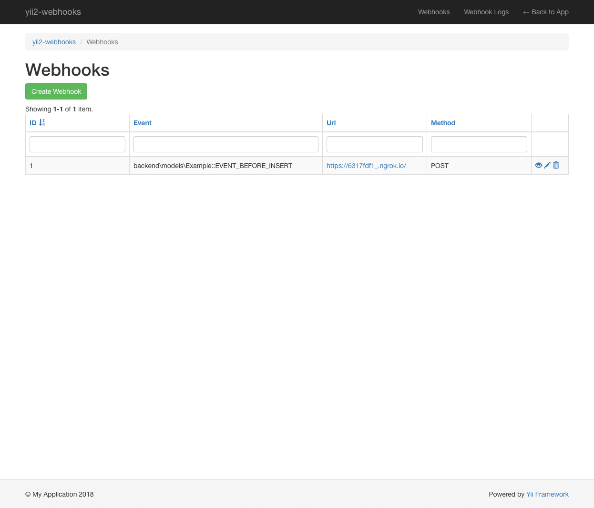

# Yii2 Webhooks

Extension for creating and using web-hooks in yii2.


## Description

Add webhooks and attach them to `ActiveRecord` objects' events to trigger HTTP requests to external systems 
(3rd party services, your own applications etc.).

### Use case example 

Let's assume that inside your project you have an `Example` class which extends `ActiveRecord`.
 
If you want to trigger a webhook every time a new `Example` record is created, you will create a new `Webhook` record, 
and assign it to your `Example` class.

You do this by setting the `event` attribute of the `Webhook` record to value of `app\models\Example::EVENT_AFTER_CREATE`.
You also set the webhook `url` and `method` values. For example `http://api.service.com` and `POST`. 

Now, every time a new `Example` record is created inside your project, your api service receives an 
http request with the `Example` object attributes.

## Installation

The preferred way to install this extension is through <a href="http://getcomposer.org/download/" target="_blank">composer</a>.

Run composer installation.

```bash
composer require --prefer-dist degordian/yii2-webhooks "*"
```

## Setup

Run the migration. It creates the _webhook_ and _webhook_log_ tables.

```bash
php yii migrate --migrationPath=@degordian/webhooks/migrations
```

The extension needs to be bootstrapped:
```php
'bootstrap' => [
    // ...
    'webhooks'
],
```

Add the module to the config:
```php
'modules' => [
    // ...
    'webhooks' => [
        'class' => 'degordian\webhooks\Module',
    ],
],
```

## Usage

### Webhooks
Create a new webhook by navigating to the _webhooks_ module: `index.php/webhooks?r=/webhooks/create`

You can use the predefined events from `BaseActiveRecord` class, e.g. `EVENT_AFTER_INSERT` or you can use your own events, e.g. `app\models\Example::EVENT_EXAMPLE`.

When triggering your custom event, make sure you __send the instantiated model__ like in the following code:
```php
Event::trigger(Example::class, Example::EVENT_EXAMPLE, new Event(['sender' => $model]));
```

### Logger
Extension logs every triggered webhook with its http request and response.

Logs are available at `index.php/webhooks?r=/webhook-log/index`

## Implementing your own EventDispatcher

You can add your own implementation of the event dispatcher to fit your needs. It must implement `EventDispatcherInterface`.

Config needs to be updated accordingly:

```php
'modules' => [
    // ...
    'webhooks' => [
        'class' => 'degordian\webhooks\Module',
        'eventDispatcherComponentClass' => 'app\components\MyDispatcher',
    ],
],
```

## Implementing your own Webhook

TBD

## Screenshots




## Contributing

Your local setup should have this repository and an existing yii2 project (preferably a clean yii2 template).

Link the repo to your project by adding it to your project's `composer.json` file: 

```
"repositories": [
    {
        "type": "path",
        "url": "../yii2-webhooks"
    }
]
```

Install it to the project using composer:

`composer require --prefer-dist degordian/yii2-webhooks "*"`

You can edit the files from within you project, directly in your `vendor` folder, for it is much more convenient that way. 

## Credits

This extension is created and maintained by [Bornfight](https://www.bornfight.com).


## License

TBD
